<div align="center">

<!-- ANIMATED WAVE HEADER -->


<!-- ANIMATED TYPING -->
<a href="https://git.io/typing-svg">
  
</a>

<br/>

<!-- BADGES -->

&nbsp;

&nbsp;

&nbsp;
<a href="https://portfolio-axhutoshs-projects.vercel.app/">
  
</a>

</div>

---

## `> whoami`


```java
public class Ashutosh extends Developer {

    String name       = "Ashutosh Kumar Sah";
    String role       = "Full Stack Developer";
    String location   = "Bengaluru, India";
    String email      = "ashutosh4u4all@gmail.com";

    String[] learning   = { "Automation Testing with Playwright" };

    String[] funFacts = {
        "Coffee-powered coder",
        "I don't create bugs, I hide features",
        "Testing is not a phase, it's a lifestyle"
    };

    String motto() {
        return "Build it. Break it. Fix it. Ship it.";
    }
}
```

<br clear="right"/>

---

## `> tech --solar-system`

<div align="center">

> 🌌 *Each planet orbits around me — Inner ring: Languages · Middle ring: Frameworks · Outer ring: Tools*



</div>

---

## `> dev --mindset`

<div align="center">

```
╔══════════════════════════════════════════════════════════════════════╗
║               💻  ASHUTOSH'S DEVELOPER PHILOSOPHY                   ║
╠══════════════════════════════════════════════════════════════════════╣
║                                                                      ║
║   "First, solve the problem. Then, write the code."                  ║
║                                                                      ║
╠══════════════════════════════════════════════════════════════════════╣
║                                                                      ║
║   🧠  Think before you type   →   Design beats brute force          ║
║   🔩  Clean code always       →   Readable > Clever                 ║
║   🔁  Iterate fast            →   Ship, learn, improve              ║
║   📦  Backend first           →   Solid APIs power great UIs        ║
║   🌐  Full stack vision       →   Own the problem end-to-end        ║
║   🤖  Automate the boring     →   Let code do the heavy lifting     ║
║                                                                      ║
╠══════════════════════════════════════════════════════════════════════╣
║                                                                      ║
║        Java ──► Spring Boot ──► REST API ──► React UI               ║
║                        └──► SQL / MongoDB                           ║
║                                                                      ║
╚══════════════════════════════════════════════════════════════════════╝
```

</div>

---

## `> showcase --projects`

<div align="center">

<a href="https://github.com/axhutosh/CineMatch">
  
</a>
<a href="https://github.com/axhutosh/IngredientInspector">
  
</a>

</div>

---

## `> testing --mindset`

<div align="center">

```
╔═══════════════════════════════════════════════════════════════╗
║              🧪  ASHUTOSH'S TESTING PHILOSOPHY               ║
╠═══════════════════════════════════════════════════════════════╣
║   "Quality is not an act, it is a habit."                    ║
║                                                               ║
║   ✅ Functional Testing      ✅ Regression Testing           ║
║   ✅ Boundary Value Analysis ✅ Equivalence Partitioning     ║
║   ✅ Smoke & Sanity Testing  ✅ API Testing via Postman      ║
║   🤖 Currently leveling up  →  Automation Testing            ║
╚═══════════════════════════════════════════════════════════════╝
```

</div>

---

## `> connect --with-me`

<div align="center">

<a href="https://www.linkedin.com/in/ashutosh-kumar-329699259/">
  
</a>&nbsp;
<a href="mailto:ashutosh4u4all@gmail.com">
  
</a>&nbsp;
<a href="https://github.com/axhutosh">
  
</a>&nbsp;
<a href="https://portfolio-axhutoshs-projects.vercel.app/">
  
</a>

<br/><br/>


<br/><br/>


</div>
